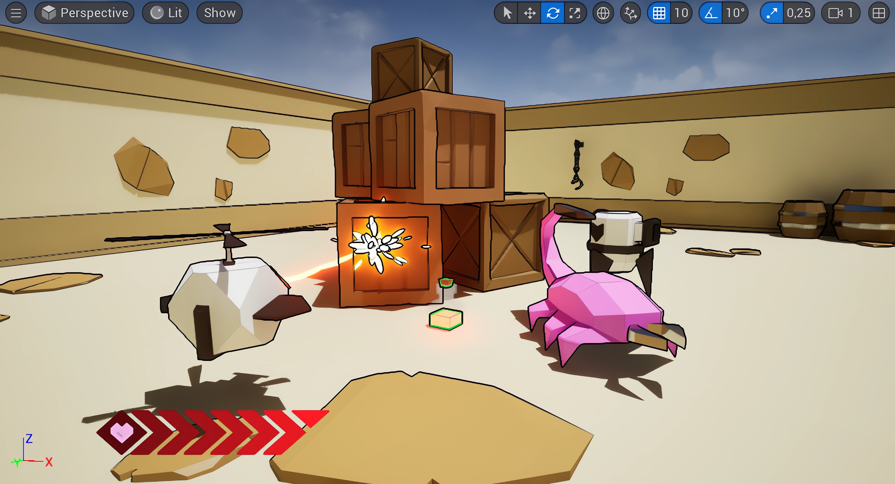
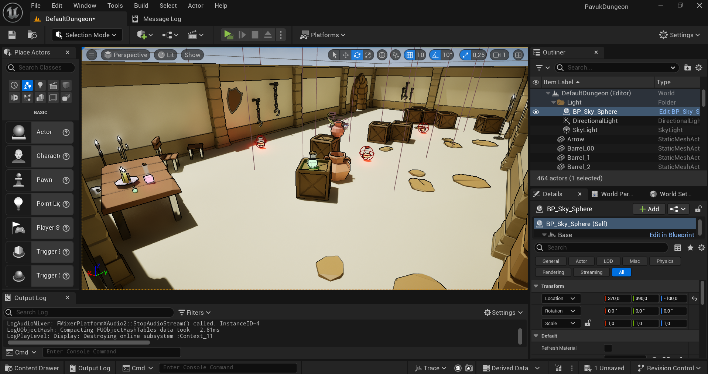
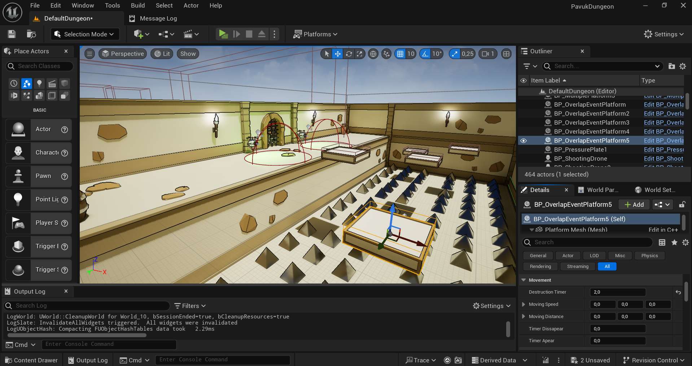
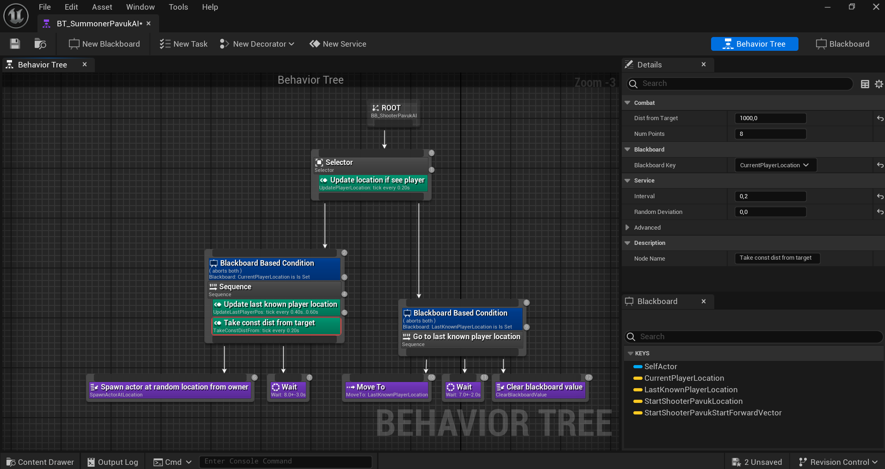

# PavukDungeon: Unreal Engine Game

## Overview
PavukDungeon is an engaging 3D game developed using Unreal Engine. In this game, players take on the role of a spider navigating through challenging levels filled with interactive mechanics. The game features moving and disappearing platforms, object interactions, and combat against AI-controlled enemies.

  

  <strong>Gameplay Video</strong>

## Features
- Interactive Levels: Navigate through levels with dynamic, moving, and disappearing platforms.
- Object Interaction: Pick up and use various items to solve puzzles and progress through the game.
- AI-Driven Enemies: Engage in battles with enemies powered by advanced AI, implemented using behavior trees in C++.
- Immersive 3D Environment: Experience a fully realized 3D world with detailed models and textures.

  

  

  <em>Map Demo</em>

## Technology Stack
- Unreal Engine: Core engine for game development, providing the framework for all game mechanics and rendering.
- C++: Programming language used to implement game logic, including AI behavior trees.
- 3D Modeling: All game assets were modeled in 3D, providing a visually rich environment.

  

  <strong>Enemy AI Behavior Tree with custom C++ nodes</strong>

## License

This project is licensed under the [Creative Commons Attribution-NonCommercial 4.0 International License](http://creativecommons.org/licenses/by-nc/4.0/).  
© 2024–2025 Dmitry Florinsky Andreevich (Dmitry31k) — You are free to use or modify this for non-commercial purposes with attribution.
